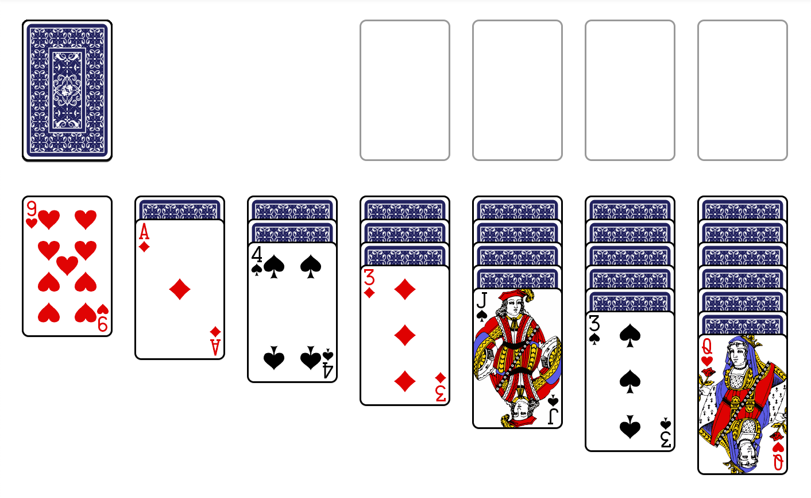

# Sample Game

Here is a sample Klondike game with the tactics described as the game is played.

## Moves from Within Tableau Only

One is lucky if there are many moves that can be from the **tableau** before beginning to process the **waste**:

### The initial state:

This is an average opening with the following available moves:

* A♦️ to **foundatation** [Ace to Foundatation](/docs/tactics.md#ace-to-foundatation) reveals K♣️.
* 3♦️ to 4♠️ [Move From Tabeau](/docs/tactics.md#move-from-tableau) reveals 10♣️.
* J♠️ to Q❤️ [Move From Tabeau](/docs/tactics.md#move-from-tableau) reveals 4♣️.

### More Tableau Only Activity

* Q❤️ to K♣️ [Move From Tabeau](/docs/tactics.md#move-from-tableau) reveals Q♦️.  This is unfortunate because of tactic [Prioritize revealing a queen's needed king]() which we should now prioritize going forward.
* Notice that we can consider moving 9❤️ to newly-revealed 10♣️; see [Don't Prematurely Move Only-Remaining Card in Tableau Column](/docs/tactics.md#dont-prematurely-move-only-remaining-card-in-tableau-column). In this case, we haven't yet revealed 9❤️ which might happen, so we'll postpone making this move.

### Current Game

At this point, the game looks like this:

There are no further tableau moves we want to make at this time, so let's start processing the **stock** to find some more cards to play.

## Processing the Stock

Now we need to click the **stock** to get further cards to play.

### Our Strategy

#### The Problem

At this point, there are 24 cards in the stock to be played.  Each time we click the stock, 3 cards are moved to the **waste** where only the last of the 3 cards can be played. So going throught the **stock**/**waste** completely will give us the opportunity to only move up to 8 of the cards.  At the end, we return the remaining **waste** back into the **stock**, and rinse/repeat.

The problem is realizing that moving cards out of the **stock** changes eligible cards remaining in the **stock** that can be played while they are moved to the **waste**.  Beginners invariably don't understand this and find they are unable to move the cards they need; this frequently results in a failed game.

#### The Solution

You need to calculate carefully the order in which the next **stock**/**waste** cards can be accessed accounting for when you've moved cards in the current sweep.

Our software implementation can/will make that much easier, but for now we have to strategize manually.

The first key recommendation is to simply sweep through the **stock**/**waste** cycle completely without moving any cards.  Instead as you process, make notes of what cards you would like to move and then move the cards you want in such a way that other cards will show up in a later sweep when you need them.

### Our First Sweep:

Click the **stock** 8 times and record the cards for each click:

| Click # | Card 1 | Card 2 | Card 3 | Notes |
|----------|---|---|---|----------|
| 1 | K❤️ | 7♦️ | 3♣️ | Tactic [Move King to its Own Tableau Column](/docs/tactics.md#move-king-to-its-own-tableau-column) wants us to K❤️ move into its own **tableau** column, but we won't be able to until the 7♦️ and 3♣️ are moved first.  At present, nowhere to move 3♣️ |
| 2 | 8♦️ | 7❤️ | 9♠️ | Nowhere to move 9♠️ |
| 3 | 10❤️ | 5♠️ | Q♠️ | Nowhere to move Q♠️ |
| 4 | 6♠️ | 9♦️ | 2♠️ | 2♠️ can be moved to 3♦️ |
| 5 | 6♣️ | 10♦️ | 9♣️ | Nowhere to move 9♣️ |
| 6 | 2❤️ | A♣️ | 8❤️ | Nowhere to move 8❤️. Plan to move A♣️ |
| 7 | A❤️ | 3❤️ | Q♣️ | Nowhere to move Q♣️. Plan to move A❤️ |
| 8 | J♦️ | 4❤️ | 5❤️ | Nowhere to move 5❤️ |

Summary

Luckily, we have one move available in step 4.  We can either click the (now empty) stock to start the next sweep or undo back to click **4** by clicking **Undo** 4 times.

### Sweep 2

Lets undo 4 times; we'll have the following partial sweep:

| Click # | Card 1 | Card 2 | Card 3 | Notes |
|----------|---|---|---|----------|
| 4 | 6♠️ | 9♦️ | 2♠️ | Move 2♠️ to 3♦️.  In the next sweep, A❤️ can be moved to the **foundation** |
| 5 | 6♣️ | 10♦️ | 9♣️ | Nowhere to move 9♣️ |
| 6 | 2❤️ | A♣️ | 8❤️ | Nowhere to move 8❤️. Plan to move A♣️ |
| 7 | A❤️ | 3❤️ | Q♣️ | Nowhere to move Q♣️. Plan to move A❤️ |
| 8 | J♦️ | 4❤️ | 5❤️ | Nowhere to move 5❤️ |

At the end, the **tableau** column 3 has 4♠️, 3♦️, and the newly added 2♠️.

### Sweep 3

Click the empty **stock** space to start this sweep and advance to click **4** in the above table.

| Click # | Card 1 | Card 2 | Card 3 | Notes |
|----------|---|---|---|----------|
| 4 | 6♠️ | 9♦️ | 6♣️ | 2♠️ has been moved to **tableau**. So now nowhere to move 6♣️.  All remaining clicks are rotated left on column in the set of 3 **waste** cards |
| 5 | 10♦️ | 9♣️ | 2❤️ | 2❤️ can be moved to tableau 3♠️. Do it, because we're about to move the A❤️ **foundation** at which time we can then forward 2❤️ to the **foundataion** as well |
| 6 | A♣️ | 8❤️ | A❤️ | Move A❤️ to **foundation**, then move 2❤️ to the **foundation** as forewarned above. |
| 7 | 3❤️ | Q♣️ | J♦️ | Nowhere to move J♦️. Plan to move A❤️ |
| 8 | J♦️ | 4❤️ | 5❤️ | Note J♦️ is repeated as a prepend to the remainder of the two cards 4❤️ and 5❤️. Nowhere to move 5❤️ |

### Sweep 4

Click the empty **stock** space to start this sweep and advance to click **4** in the above table.

| Click # | Card 1 | Card 2 | Card 3 | Notes |
|----------|---|---|---|----------|
| 5 | 6♠️ | 9♦️ | 6♣️ | Nowhere to move 6♣️. |
| 6 | 10♦️ | 9♣️ | A♣️ | Cards shifted left; now move A♣️ to the **foundation** |
| 7 | 8❤️ | 3❤️ | Q♣️ | Nowherer to move Q♣️ |
| 8 | J♦️ | 4❤️ | 5❤️ | Nowhere to move 5❤️ |

Here's our game now:

 

### Sweep 5

Click the empty **stock** space to start this sweep and advance to click **4** in the above table.

## Links

[Back to README](/README.md)
